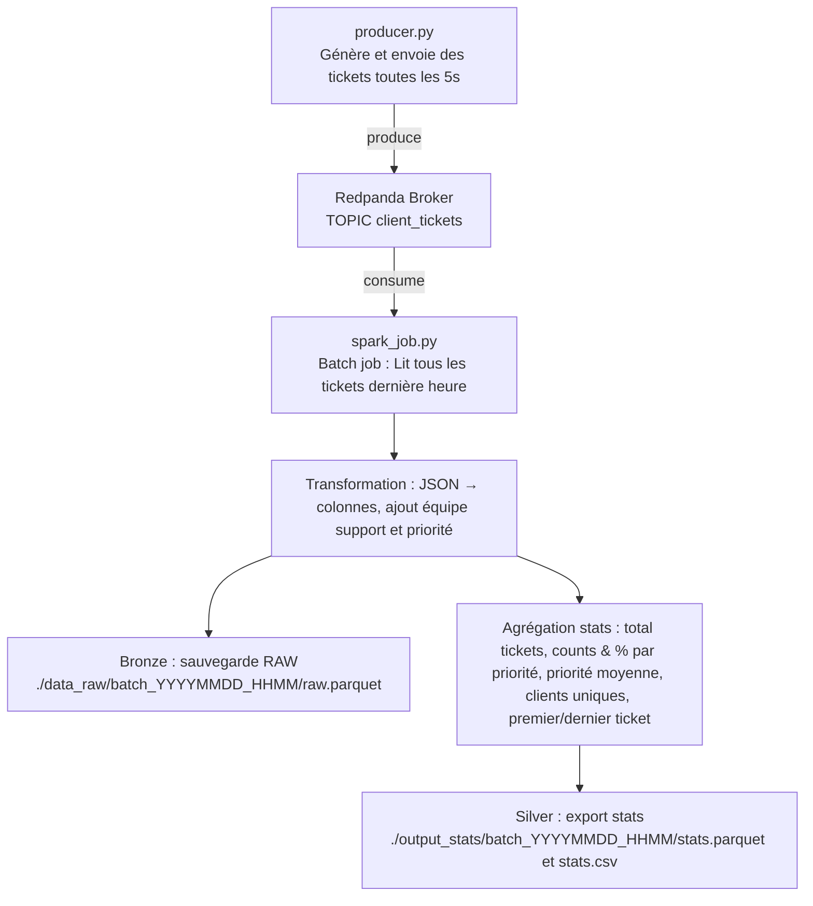

# OCR - Projet 9  
**Modélisez une infrastructure dans le cloud**  
*Février 2026*  

## Contexte du projet
Le projet comporte deux parties :  

**Partie 1 :** Modéliser une infrastructure hybride dans le cloud  
**Partie 2 :** Gérer des tickets clients avec Redpanda et PySpark

---

## Partie 1 : Infrastructure hybride
**Contexte :**  
InduTech Data, spécialisée en analyse de données industrielles, a intégré des solutions IoT (capteurs, objets connectés…). Cela génère un volume croissant de données que le datacenter actuel ne peut plus absorber (augmentation mensuelle de 50 Go de données en temps réel, principalement des flux continus nécessitant un traitement rapide et fiable).  

**Problème :** limites de capacité et de performance de l’infrastructure on-premise.  

**Objectif :** moderniser la gestion des données en :  
- Intégrant une architecture hybride on-premise ↔ cloud  
- Intégrant un moteur de streaming (Redpanda) pour les flux temps réel  
- Migrant partiellement vers le cloud (AWS) pour scalabilité et performance  
- Maintenir une infrastructure locale pour la gestion des identités  

**Livrable :**  
- Rapport d'audit avec sélection de composants cloud pour une architecture hybride  
- Schéma illustrant le flux de données entre on-premise et cloud  

---

## Partie 2 : POC Gestion des tickets clients en temps réel

Les tickets contiennent :  
- ID du ticket  
- ID du client  
- Date et heure de création  
- Demande  
- Type de demande  
- Priorité  

**Objectif :** Mettre en place un pipeline ETL capable de :  
1. Ingestion des tickets en temps réel via **Redpanda**  
2. Traitement et analyse avec **PySpark**  
3. Génération d'un rapport et insights pour le support client  

Le POC simule un broker Redpanda local pour valider le fonctionnement du pipeline.

---

## Architecture et pipeline  



### Description du pipeline
- **Producer Python** : génère et envoie les tickets vers le topic `client_tickets`  
- **Redpanda Broker** : stocke les tickets 
- **PySpark Batch Job** :  
  - Lit les tickets de la dernière heure  
  - Transforme → colonnes et ajoute équipe support + priorité  
  - Agrège les statistiques par type de demande et équipe support  
- **Stockage** :  
  - **Bronze** : tickets bruts (`./data_raw/...`)  
  - **Silver** : statistiques agrégées (`./output_stats/...`)  
- **Orchestration** : Docker Compose pour Redpanda, console et jobs PySpark/producer  

### ETL – Transformations clés
- Nettoyage et parsing des tickets JSON  
- Ajout de colonnes dérivées : année, mois, jour, heure, équipe support, priorité numérique  
- Calculs statistiques :  
  - Total de tickets  
  - Nombre et pourcentage par priorité  
  - Priorité moyenne  
  - Clients uniques  
  - Date du premier et dernier ticket  

### Tests unitaires et d’intégration
- Vérification des JSON reçus  
- Attribution correcte des tickets aux équipes  
- Lecture du topic Kafka et création des fichiers RAW / stats  
- Performance et fiabilité du job PySpark  

### Contenu du projet
```text
Solisdata/
├── producer/
│   ├── producer_ticket.py       # Script Python pour produire les tickets vers Kafka
│   ├── Dockerfile               # Containerisation du producer
│   └── requirements.txt         # Dépendances du producer
├── spark_job/
│   ├── spark_job_redpanda_batch.py # Job PySpark pour transformation et agrégation
│   ├── Dockerfile                  # Containerisation du job PySpark
│   └── requirements.txt            # Dépendances du job PySpark
├── data_raw/                      # Zone Bronze : tickets bruts
├── output_stats/                  # Zone Silver : fichiers statistiques
├── presentation/                  # Documentation et visualisations
├── config.py                      # Paramètres du pipeline (broker, topic, priorités, etc.)
├── .gitignore
├── docker-compose.yml             # Orchestration Redpanda et jobs
├── README.md
└── requirements.txt               # Dépendances globales
```

### Justification des choix technologiques
- **Redpanda** : Redpanda reçoit des flux de données continus (comme tes tickets clients) et les stocke temporairement dans des “topics”
- **PySpark** : traitement parallèle et agrégation massive de données - Le moteur Spark démarre un driver, Le driver distribue le travail aux executors (processus qui font réellement le calcul), les executors lisent les nouvelles données au fil de l’eau, appliquent les transformations et écrivent les résultats.Spark fait la boucle automatiquement : il surveille la source, crée des micro-batchs, exécute le job, répète.   
- **Docker / Docker Compose** : containerisation et orchestration pour automatiser le pipeline ETL  
- **Parquet** : formats standards pour stockage et analyse  

### Outils utilisés
- Python  
- PySpark  
- Redpanda 
- Docker / Docker Compose  
