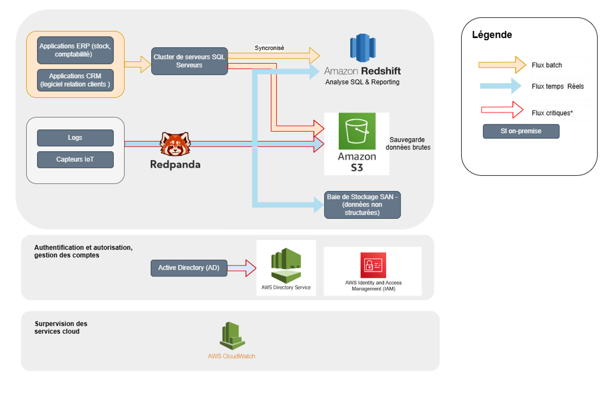
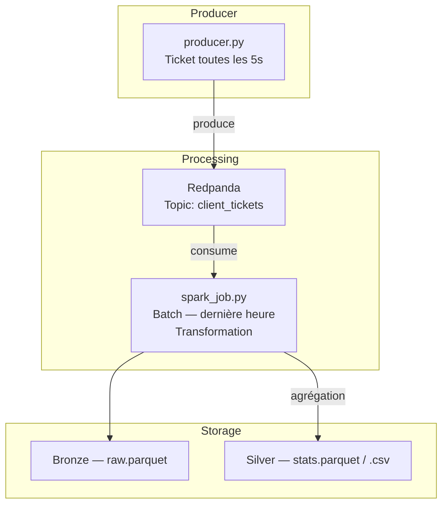

# OCR - Projet 9  
**Modélisez une infrastructure dans le cloud**  
*Février 2026*  

## Contexte du projet
InduTech Data, spécialisée en analyse de données industrielles, a intégré des solutions IoT (capteurs, objets connectés…). Cela génère un volume croissant de données que le datacenter actuel ne peut plus absorber (augmentation mensuelle de 50 Go de données en temps réel, principalement des flux continus nécessitant un traitement rapide et fiable).  

**Problème :** limites de capacité et de performance de l’infrastructure on-premise.  
Le projet comporte deux parties :  

**Partie 1 :** Modéliser une infrastructure hybride dans le cloud  
**Partie 2 :** POC : Gérer des tickets clients avec Redpanda et PySpark


## Partie 1 
**Objectif :** L'objectif de la partie 1 est de préparer la modernisation la gestion des données en définissant une architecture hybride on-premise ↔ cloud adapter au besoin de l'entreprise. 
Les enjeux identifiés sont les suivants : 
- intégrer un moteur de streaming (Redpanda) pour les flux temps réel,  
- migrer partiellement vers le cloud (AWS) pour la scalabilité et performance,  
- maintenir une infrastructure locale pour la gestion des identités.

**Livrables :**  
- Rapport d'audit avec sélection de composants cloud pour une architecture hybride  
- Schéma illustrant le flux de données entre on-premise et cloud


---

## Partie 2 : POC (Proof Of Concept) sur un système de gestion de tickets clients. 

**Objectif :** L'objectif  est faire un POC (Proof Of Concept) sur un système de gestion de tickets clients et de mettre en place un pipeline ETL capable de :  
1. Générer une simulation de flux tickets clients en temps réel contenant les informations sur les demande, le client, etc.
2. Ingerer des tickets en temps réel via **Redpanda**  
3. Traiter et analyser les tickets avec **PySpark**  
4. Génération des insights.

---
### Description du pipeline
- **Producer Python** : génère et envoie les tickets vers le topic `client_tickets`  
- **Redpanda Broker** : stocke les tickets 
- **PySpark Batch Job** :  
  - Lit les tickets de la dernière heure  
  - Transforme → colonnes et ajoute équipe support + priorité  
  - Agrège les statistiques par type de demande et équipe support  
- **Stockage** :  
  - **Bronze** : tickets bruts (`./data_raw/...`)  
  - **Silver** : statistiques agrégées (`./output_stats/...`)  
- **Orchestration** : Docker Compose pour Redpanda, console et jobs PySpark/producer  

## Architecture et pipeline  

### Description du pipeline
- **Producer Python** : génère et envoie les tickets vers le topic `client_tickets`  
- **Redpanda Broker** : stocke les tickets 
- **PySpark Batch Job** :  
  - Lit les tickets de la dernière heure  
  - Transforme → colonnes et ajoute équipe support + priorité  
  - Agrège les statistiques par type de demande et équipe support  
- **Stockage** :  
  - **Bronze** : tickets bruts (`./data_raw/...`)  
  - **Silver** : statistiques agrégées (`./output_stats/...`)  
- **Orchestration** : Docker Compose pour Redpanda, console et jobs PySpark/producer

  



### ETL – Transformations clés
- Nettoyage et parsing des tickets JSON  
- Ajout de colonnes dérivées : année, mois, jour, heure, équipe support, priorité numérique  
- Calculs statistiques :  
  - Total de tickets  
  - Nombre et pourcentage par priorité  
  - Priorité moyenne  
  - Clients uniques  
  - Date du premier et dernier ticket  

## Contenu du projet
```text
Solisdata/
├── producer/
│   ├── producer_ticket.py       # Script Python pour produire les tickets vers Kafka
│   ├── Dockerfile               # Containerisation du producer
│   └── requirements.txt         # Dépendances du producer
├── spark_job/
│   ├── spark_job_redpanda_batch.py # Job PySpark pour transformation et agrégation
│   ├── Dockerfile                  # Containerisation du job PySpark
│   └── requirements.txt            # Dépendances du job PySpark
├── data_raw/                      # Zone Bronze : tickets bruts
├── output_stats/                  # Zone Silver : fichiers statistiques
├── presentation/                  # Documentation et visualisations
├── config.py                      # Paramètres du pipeline (broker, topic, priorités, etc.)
├── .gitignore
├── docker-compose.yml             # Orchestration Redpanda et jobs
├── README.md
└── requirements.txt               # Dépendances globales
```

## Justification des choix technologiques
- **Redpanda** : Redpanda reçoit des flux de données continus (comme tes tickets clients) et les stocke temporairement dans des “topics”
- **PySpark** : traitement parallèle et agrégation massive de données - Le moteur Spark démarre un driver, Le driver distribue le travail aux executors (processus qui font réellement le calcul), les executors lisent les nouvelles données au fil de l’eau, appliquent les transformations et écrivent les résultats.Spark fait la boucle automatiquement : il surveille la source, crée des micro-batchs, exécute le job, répète.   
- **Docker / Docker Compose** : containerisation et orchestration pour automatiser le pipeline ETL  
- **Parquet** : formats standards pour stockage et analyse  

## Outils utilisés
- Python  
- PySpark  
- Redpanda 
- Docker / Docker Compose  
